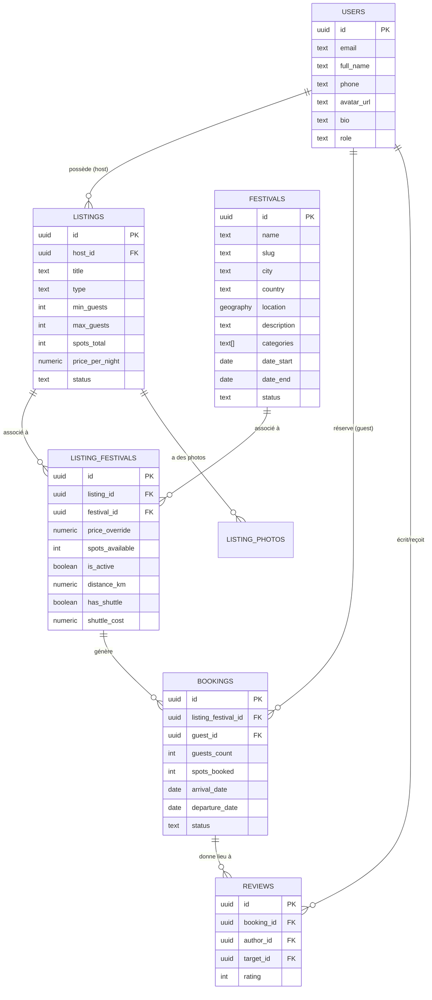

# Schéma de base de données — Festcamp

> Marketplace de mise en relation entre hôtes (propriétaires de logements) et festivaliers, autour de festivals répartis dans plusieurs pays, villes et types d'événements.

Document de référence pour la modélisation des données. Version : **v1 (MVP)**.

---

## 1. Stack technique retenue

- **Base de données** : PostgreSQL (extension **PostGIS** pour la géolocalisation — recherche de logements par distance/rayon autour d'un festival)
- **Hébergement suggéré** : Supabase (Postgres managé + PostGIS activable + Auth + Storage) ou Neon (Postgres serverless) selon les besoins d'infra
- **ORM suggéré** : Drizzle (proche du SQL, adapté aux requêtes géospatiales et aux contraintes custom)

Le choix de Postgres est motivé par :

- l'intégrité transactionnelle nécessaire aux réservations (éviter le double-booking),
- le volume de relations entre entités (hôte ↔ logement ↔ festival ↔ réservation ↔ avis),
- le support natif du géospatial via PostGIS.

---

## 2. Vue d'ensemble des entités



---

## 3. Détail des tables

### 3.1 `users`

Compte unique à double rôle **host/guest** : un même utilisateur peut publier des logements (hôte) et réserver (festivalier). Ce double rôle métier reste implicite (dérivé de l'existence d'au moins une ligne dans `listings`), pas de champ dédié.

Un champ `role` distinct a été ajouté a posteriori (voir [`admin-setup.md`](admin-setup.md)) pour un troisième rôle **technique/administratif** (`user` | `admin`), sans rapport avec host/guest — sert uniquement à protéger l'accès au dashboard `/admin`.

| Champ        | Type        | Contraintes              | Notes                                                                                                                                     |
| ------------ | ----------- | ------------------------ | ----------------------------------------------------------------------------------------------------------------------------------------- |
| `id`         | uuid        | PK                       |                                                                                                                                           |
| `email`      | text        | UNIQUE, NOT NULL         |                                                                                                                                           |
| `full_name`  | text        |                          |                                                                                                                                           |
| `phone`      | text        | NULL                     |                                                                                                                                           |
| `avatar_url` | text        | NULL                     |                                                                                                                                           |
| `bio`        | text        | NULL                     | Important : sans paiement en ligne (MVP), la confiance repose sur le profil + les avis                                                    |
| `city`       | text        | NULL                     | "Lieu d'habitation" — non confidentiel, consultable par un hôte lors d'une demande de mise en relation (voir `booking-requests-setup.md`) |
| `birth_date` | date        | NULL                     | Sert à calculer l'âge affiché à l'hôte — la date elle-même n'est jamais exposée, seul l'âge calculé                                       |
| `role`       | text        | NOT NULL, DEFAULT 'user' | `user` \| `admin` — accès au dashboard `/admin`                                                                                           |
| `created_at` | timestamptz |                          |                                                                                                                                           |
| `updated_at` | timestamptz |                          |                                                                                                                                           |

---

### 3.2 `festivals`

Créés et curatés **exclusivement par l'admin** (back-office), pas d'ajout libre par les utilisateurs pour le MVP — garantit une base de données propre pour le matching géographique.

| Champ             | Type                  | Contraintes                          | Notes                                                                                                                                                                                                                                |
| ----------------- | --------------------- | ------------------------------------ | ------------------------------------------------------------------------------------------------------------------------------------------------------------------------------------------------------------------------------------ |
| `id`              | uuid                  | PK                                   |                                                                                                                                                                                                                                      |
| `name`            | text                  | NOT NULL                             |                                                                                                                                                                                                                                      |
| `slug`            | text                  | UNIQUE, NOT NULL                     |                                                                                                                                                                                                                                      |
| `city`            | text                  | NOT NULL                             |                                                                                                                                                                                                                                      |
| `country`         | text                  | NOT NULL                             | Code ISO                                                                                                                                                                                                                             |
| `location`        | geography(Point)      |                                      | PostGIS — lat/lng                                                                                                                                                                                                                    |
| `description`     | text                  | NULL                                 | Texte libre optionnel, affiché en haut de la page détail festival. Voir `festival-detail-setup.md` §10                                                                                                                               |
| `categories`      | `festival_category[]` | NOT NULL, DEFAULT `{}`               | Catégories fixes cumulables (`musique`, `litteraire`, `evenementiel`, `culturel`) — un festival peut être à la fois `evenementiel` et `culturel`. Remplace l'ancien champ `type` en texte libre. Voir `festival-categories-setup.md` |
| `date_start`      | date                  | NOT NULL                             |                                                                                                                                                                                                                                      |
| `date_end`        | date                  | NOT NULL                             |                                                                                                                                                                                                                                      |
| `cover_image_url` | text                  | NULL                                 |                                                                                                                                                                                                                                      |
| `status`          | text                  | DEFAULT 'draft'                      | `draft` \| `published`                                                                                                                                                                                                               |
| `created_by`      | uuid                  | FK → users, NULL, ON DELETE SET NULL | Champ d'attribution (qui a créé la fiche) — passe à NULL si l'admin est supprimé, ne bloque pas la suppression                                                                                                                       |
| `created_at`      | timestamptz           |                                      |                                                                                                                                                                                                                                      |
| `updated_at`      | timestamptz           |                                      |                                                                                                                                                                                                                                      |

---

### 3.3 `listings`

Fiche logement créée par l'hôte, associée à **un seul festival** via `listing_festivals` (voir §3.5 et §4.1 — revu depuis le modèle hybride multi-festivals de la v1 initiale).

Soumise à **modération admin obligatoire** avant publication.

| Champ                         | Type             | Contraintes                          | Notes                                                                                                                                |
| ----------------------------- | ---------------- | ------------------------------------ | ------------------------------------------------------------------------------------------------------------------------------------ |
| `id`                          | uuid             | PK                                   |                                                                                                                                      |
| `host_id`                     | uuid             | FK → users, NOT NULL                 |                                                                                                                                      |
| `title`                       | text             | NOT NULL                             |                                                                                                                                      |
| `description`                 | text             |                                      |                                                                                                                                      |
| `address`                     | text             |                                      |                                                                                                                                      |
| `city`                        | text             |                                      |                                                                                                                                      |
| `country`                     | text             |                                      |                                                                                                                                      |
| `location`                    | geography(Point) |                                      | PostGIS                                                                                                                              |
| `type`                        | text             | NOT NULL                             | `entire_place` \| `private_room` \| `camping_spot` \| `glamping` \| `couch`                                                          |
| `min_guests`                  | int              | NULL                                 | Minimum de festivaliers, entre 2 et 10 — types "bloquants" uniquement, voir `listings-setup.md` §15                                  |
| `max_guests`                  | int              |                                      | Maximum de festivaliers, entre 2 et 10 — pertinent pour les types "bloquants" (`entire_place`, `private_room`)                       |
| `spots_total`                 | int              | NULL                                 | Nombre de places individuelles, entre 2 et 10 — types "à places" (`camping_spot`, `glamping`, `couch`), voir `listings-setup.md` §16 |
| `price_per_night`             | numeric(10,2)    |                                      | Prix par nuit et par voyageur, fixé librement par l'hôte (cf. §4.2)                                                                  |
| `amenities`                   | jsonb            | NULL                                 | Liste flexible d'équipements                                                                                                         |
| `status`                      | text             | DEFAULT 'draft'                      | `draft` → `pending_review` → `published` \| `rejected` → `archived` (voir §4.3)                                                      |
| `submitted_at`                | timestamptz      | NULL                                 | Date de soumission à la modération                                                                                                   |
| `reviewed_by`                 | uuid             | FK → users, NULL, ON DELETE SET NULL | Admin ayant traité la demande — champ d'attribution, cf. `festivals.created_by`                                                      |
| `reviewed_at`                 | timestamptz      | NULL                                 |                                                                                                                                      |
| `rejection_reason`            | text             | NULL                                 |                                                                                                                                      |
| `certification_document_path` | text             | NULL                                 | Chemin (pas une URL publique) vers un justificatif de domicile dans un bucket Storage **privé** — voir §4.8                          |
| `created_at`                  | timestamptz      |                                      |                                                                                                                                      |
| `updated_at`                  | timestamptz      |                                      |                                                                                                                                      |

> Le mode de réservation ("bloque tout le logement" vs "places individuelles") est **dérivé du champ `type` en code applicatif**, pas stocké en base pour le MVP.

---

### 3.4 `listing_photos`

| Champ        | Type | Contraintes             | Notes             |
| ------------ | ---- | ----------------------- | ----------------- |
| `id`         | uuid | PK                      |                   |
| `listing_id` | uuid | FK → listings, NOT NULL |                   |
| `url`        | text | NOT NULL                |                   |
| `position`   | int  | DEFAULT 0               | Ordre d'affichage |

---

### 3.5 `listing_festivals`

Table d'association logement ↔ festival — **un logement ne peut être associé qu'à un seul festival** (revu depuis la v1 initiale, qui autorisait plusieurs festivals par logement). Reste une table à part (plutôt qu'une simple colonne `festival_id` sur `listings`) pour conserver le tarif/les places spécifiques à l'association sans surcharger `listings`.

| Champ                   | Type          | Contraintes                         | Notes                                                                                                                                            |
| ----------------------- | ------------- | ----------------------------------- | ------------------------------------------------------------------------------------------------------------------------------------------------ |
| `id`                    | uuid          | PK                                  |                                                                                                                                                  |
| `listing_id`            | uuid          | FK → listings, NOT NULL, **UNIQUE** | Un logement ne peut apparaître qu'une seule fois dans cette table                                                                                |
| `festival_id`           | uuid          | FK → festivals, NOT NULL            |                                                                                                                                                  |
| `price_override`        | numeric(10,2) | NULL                                | Si NULL, fallback sur `listings.price_per_night`. Non collecté dans le formulaire de création actuel (v1), colonne conservée pour un usage futur |
| `spots_available`       | int           | NULL                                | Override de `listings.spots_total` pour ce festival précis                                                                                       |
| `arrival_buffer_before` | int           | DEFAULT 1                           | Nombre de jours autorisés avant le début du festival — choix binaire (0 ou 1) exposé à l'hôte, voir `listings-setup.md` §14                      |
| `arrival_buffer_after`  | int           | DEFAULT 1                           | Nombre de jours autorisés après la fin du festival — même choix, toujours égal à `arrival_buffer_before` (`listings-setup.md` §14)               |
| `is_active`             | boolean       | DEFAULT true                        | Permet de désactiver temporairement sans supprimer                                                                                               |
| `distance_km`           | numeric(6,2)  | NULL                                | Distance déclarée par l'hôte entre le logement et le festival — saisie manuelle, pas de géocodage automatique                                    |
| `has_shuttle`           | boolean       | NOT NULL, DEFAULT false             | L'hôte propose un service de navette jusqu'au festival                                                                                           |
| `shuttle_cost`          | numeric(10,2) | NOT NULL, DEFAULT 0                 | Coût supplémentaire de la navette — forcé à 0 si `has_shuttle = false`                                                                           |
| `created_at`            | timestamptz   |                                     |                                                                                                                                                  |

Contrainte : `UNIQUE (listing_id)` (voir §4.1 — un logement, au plus un festival).

> Le **tarif conseillé** (basé sur la distance logement ↔ festival) est calculé à la volée côté application (formule distance × barème), **non stocké** en base pour le MVP.

---

### 3.6 `bookings`

Les dates de séjour sont **entièrement dérivées du festival** (`festival.date_start/date_end` ± buffers de `listing_festivals`) — pas de sélection libre nuit par nuit pour le MVP.

Chaque demande doit être **validée manuellement par l'hôte** (pas de réservation instantanée), cohérent avec l'absence de paiement en ligne. Sert aussi de **demande de mise en relation** (implémentation détaillée dans [`booking-requests-setup.md`](booking-requests-setup.md)) : c'est en créant un `booking` qu'un festivalier révèle à l'hôte ses informations non confidentielles (nom complet, photo de profil, ville, âge — jamais avant).

| Champ                 | Type          | Contraintes                      | Notes                                                                                                                                                                                                                                                                          |
| --------------------- | ------------- | -------------------------------- | ------------------------------------------------------------------------------------------------------------------------------------------------------------------------------------------------------------------------------------------------------------------------------ |
| `id`                  | uuid          | PK                               |                                                                                                                                                                                                                                                                                |
| `listing_festival_id` | uuid          | FK → listing_festivals, NOT NULL |                                                                                                                                                                                                                                                                                |
| `guest_id`            | uuid          | FK → users, NOT NULL             |                                                                                                                                                                                                                                                                                |
| `guests_count`        | int           | DEFAULT 1                        | Nombre de personnes dans le groupe — renseigné par le festivalier sur le formulaire de demande, borné par la capacité du logement et jamais en dessous de 2 (voir `booking-requests-setup.md` §12/§13)                                                                         |
| `spots_booked`        | int           | DEFAULT 1                        | Nombre de places consommées (types "à places") — **pas encore dérivé de `guests_count`**, voir `booking-requests-setup.md` §12 "Non traité"                                                                                                                                    |
| `arrival_date`        | date          | NULL                             | Date d'arrivée déclarée par le festivalier — doit tomber dans la fenêtre festival ± buffer (voir §4.1 ci-dessous), `booking-requests-setup.md` §12                                                                                                                             |
| `departure_date`      | date          | NULL                             | Date de départ déclarée par le festivalier — même fenêtre que `arrival_date`                                                                                                                                                                                                   |
| `status`              | text          | DEFAULT 'pending'                | `pending` \| `accepted` \| `rejected` \| `cancelled` — `cancelled` recouvre deux origines distinctes : annulation automatique passé le délai de 48h sans partage d'email (`booking-requests-setup.md` §18) ; pas d'annulation manuelle par une des deux parties pour le MVP    |
| `message`             | text          | NULL                             | Message du festivalier à l'hôte                                                                                                                                                                                                                                                |
| `price_agreed`        | numeric(10,2) | NULL                             | Snapshot du **prix total** au moment de la demande (`price_per_night × nuits × voyageurs`, cf. §4.2) — pas juste le tarif unitaire                                                                                                                                             |
| `rejection_reason`    | text          | NULL                             | Motif renseigné par l'hôte en cas de refus (`rejected`), consultable par le festivalier sur `/mes-demandes` — champ réutilisé tel quel pour le motif d'annulation automatique (`cancelled`, `booking-requests-setup.md` §18), pas de colonne dédiée pour ce texte fixe         |
| `acceptance_message`  | text          | NULL                             | Message optionnel de l'hôte à l'acceptation (contact, consignes d'arrivée...), consultable par le festivalier sur `/mes-demandes` (`booking-requests-setup.md` §14)                                                                                                            |
| `guest_email_shared`  | boolean       | NOT NULL, DEFAULT false          | Partage volontaire de l'email du festivalier avec l'hôte, uniquement après acceptation et dans les 48h suivant `responded_at` — jamais automatique (`booking-requests-setup.md` §15/§16). Passé ce délai sans partage, la demande bascule automatiquement en `cancelled` (§18) |
| `created_at`          | timestamptz   |                                  |                                                                                                                                                                                                                                                                                |
| `responded_at`        | timestamptz   | NULL                             |                                                                                                                                                                                                                                                                                |

**Contraintes d'intégrité — appliquées en code applicatif, pas en base :**

Ces deux invariants ne sont **pas** exprimés comme des contraintes SQL (pas d'index unique partiel, pas de trigger) — ils sont revérifiés à chaque acceptation dans `acceptBookingAction` (voir `src/lib/bookings/actions.ts`), par une requête de contrôle juste avant l'écriture. Un vrai verrou transactionnel serait plus robuste face à deux acceptations concurrentes sur le même logement, mais n'a pas été jugé nécessaire pour le volume du MVP — piste v2 si le besoin se confirme.

- Types "bloquants" (`entire_place`, `private_room`) : un seul `booking` avec `status = 'accepted'` actif par `listing_festival_id`.
- Types "à places" (`camping_spot`, `glamping`, `couch`) : `SUM(spots_booked)` des bookings `accepted` ne doit jamais dépasser `spots_available` (ou `listings.spots_total` si non défini).

**Hors scope MVP** : pas de paiement en ligne (Stripe Connect), pas de politique d'annulation avec pénalités — le règlement se fait hors plateforme entre hôte et festivalier une fois la demande acceptée.

---

### 3.7 `reviews`

Système d'avis **bidirectionnel** (le festivalier note l'hôte/logement, l'hôte note le festivalier) — élément de confiance central en l'absence de protection financière via paiement en ligne.

| Champ        | Type        | Contraintes                      | Notes            |
| ------------ | ----------- | -------------------------------- | ---------------- |
| `id`         | uuid        | PK                               |                  |
| `booking_id` | uuid        | FK → bookings, NOT NULL          |                  |
| `author_id`  | uuid        | FK → users, NOT NULL             | Auteur de l'avis |
| `target_id`  | uuid        | FK → users, NOT NULL             | Personne notée   |
| `rating`     | int         | NOT NULL, CHECK (1 ≤ rating ≤ 5) |                  |
| `comment`    | text        | NULL                             |                  |
| `created_at` | timestamptz |                                  |                  |

Contrainte : `UNIQUE (booking_id, author_id)` — un seul avis par personne et par réservation.

**Éligibilité** (règle applicative, pas stockée) : `booking.status = 'accepted'` **ET** date actuelle > `festival.date_end`.

---

## 4. Règles métier clés

### 4.1 Association logement ↔ festival (un seul festival par logement)

À la création, l'hôte sélectionne **un unique festival** dans une liste (festivals publiés) via `listing_festivals`, avec possibilité de personnaliser le tarif pour ce festival. Contrainte `UNIQUE(listing_id)` en base — un logement ne peut pas être associé à plusieurs festivals. _(Revu depuis la v1 initiale qui autorisait un modèle hybride multi-festivals par logement.)_

### 4.2 Tarification

Le prix est **par nuit et par voyageur** (`listings.price_per_night`), fixé librement par l'hôte — _(revu depuis la v1 initiale qui documentait un forfait fixe pour la durée du séjour ; correspond au libellé affiché dans le formulaire de création, "Prix par nuit par voyageur")_.

Le nombre de nuits n'est **pas saisi par l'hôte ni choisi librement par le festivalier** : il reste dérivé des dates du festival ± buffer (`listing_festivals.arrival_buffer_before/after`), cohérent avec §4.5. Le montant total d'une réservation se calcule donc :

```
total = price_per_night × nombre_de_nuits × nombre_de_voyageurs
```

où `nombre_de_nuits` = `(festival.date_end − festival.date_start) + arrival_buffer_before + arrival_buffer_after`, et `nombre_de_voyageurs` = `bookings.guests_count`. Ce calcul n'est pas encore implémenté (le flow de réservation lui-même reste à construire) — voir `bookings.price_agreed` §3.6.

La plateforme peut afficher un **tarif conseillé** (par nuit) calculé selon la distance entre le logement et le lieu du festival (calcul applicatif, non persisté).

### 4.3 Modération des logements

Workflow de publication : `draft` (édition par l'hôte) → `pending_review` (soumis) → validation admin → `published` (visible publiquement) **ou** `rejected` (motif renseigné, l'hôte peut corriger et resoumettre) → `archived` (retiré).

**Toute modification d'un logement existant repasse systématiquement sa fiche en `pending_review`** (`rejection_reason`/`reviewed_by`/`reviewed_at` réinitialisés, `submitted_at` mis à jour), quel que soit son statut précédent — y compris depuis `published`. Une fiche publiée qui vient d'être modifiée redevient donc immédiatement **indisponible publiquement** (les pages publiques ne montrent que `status = 'published'`, §3.3) jusqu'à sa revalidation par un admin. Pas de diff de contenu pour décider si la modification est "significative" — chaque soumission du formulaire d'édition déclenche la repasse en modération. Voir `listings-setup.md` §8.

### 4.4 Capacité selon le type de logement

- **Types "bloquants"** (`entire_place`, `private_room`) : une réservation acceptée occupe tout le logement pour la période du festival.
- **Types "à places"** (`camping_spot`, `glamping`, `couch`) : plusieurs festivaliers indépendants peuvent réserver des places distinctes sur le même logement, dans la limite de `spots_available`.

### 4.5 Flow de réservation

Demande → validation manuelle par l'hôte (`pending` → `accepted`/`rejected`). Pas de réservation instantanée pour le MVP. Pas de messagerie in-app : les coordonnées sont échangées hors plateforme une fois la demande acceptée.

### 4.6 Comptes utilisateurs

Compte unique à double rôle hôte/festivalier — pas de séparation de compte à l'inscription.

### 4.7 Un seul logement par hôte

Un hôte ne peut créer et gérer qu'**un seul logement**. Pas de contrainte `UNIQUE(host_id)` en base (pas nécessaire tant que l'application applique la règle de façon cohérente) — appliquée en code applicatif : `/logements/nouveau` redirige vers l'édition du logement existant (`/logements/[id]/modifier`) si `listings.host_id = user.id` a déjà une ligne. Toute modification repasse la fiche en `pending_review` (motif/`reviewed_by`/`reviewed_at` réinitialisés), cohérent avec le workflow §4.3. Voir `listings-setup.md` §8.

_(Cette règle a brièvement été retirée puis rétablie en cours de route — le script de seed créait plusieurs logements par hôte de démo, ce qui a fait passer la contrainte pour une hypothèse erronée ; les données de seed ont depuis été corrigées à un logement par hôte pour rester cohérentes avec la règle produit réelle.)_

### 4.8 Pastille « hôte certifié »

À la création ou modification de sa fiche, l'hôte peut fournir un justificatif de domicile (facture EDF, internet...) — **optionnel**, le logement peut être créé/publié sans. Sa seule fonction est de conditionner l'affichage d'une pastille « Hôte certifié » sur la fiche logement et les cards de recherche : `certified = Boolean(listings.certification_document_path)`, dérivé en code applicatif, pas de colonne booléenne dédiée (même logique que `BLOCKING_LISTING_TYPES` dérivé de `type`, §3.3).

Pas de vérification du contenu par l'admin pour le MVP — la présence du fichier suffit à déclencher la pastille, aucune étape de validation manuelle dédiée (distincte de la modération générale du logement, §4.3). Piste v2 si la confiance portée à la pastille doit être renforcée : point de contrôle explicite dans le workflow de modération.

Stockage : bucket Supabase Storage **privé** `listing-certification-docs` (contrairement à `listing-photos`, public) — ce document contient des données personnelles de l'hôte (adresse, nom). Seul un lien signé temporaire (60s), généré à la demande côté serveur, permet à l'admin de le consulter depuis `/admin/logements` ; jamais d'URL publique ni d'exposition côté festivalier. Voir `listings-setup.md` §9.

---

## 5. Décisions produit validées (MVP)

| Sujet                             | Décision                                                                                                                                                                                                                                                                                                                                                                                                                                                                                                                             |
| --------------------------------- | ------------------------------------------------------------------------------------------------------------------------------------------------------------------------------------------------------------------------------------------------------------------------------------------------------------------------------------------------------------------------------------------------------------------------------------------------------------------------------------------------------------------------------------ |
| Association logement/festival     | **Un seul festival par logement** (revu depuis le modèle hybride multi-festivals initial), sélection via liste à la création                                                                                                                                                                                                                                                                                                                                                                                                         |
| Types de logement                 | Logement entier, chambre privée, camping/emplacement, glamping, canapé (type WWOOFing/couch)                                                                                                                                                                                                                                                                                                                                                                                                                                         |
| Tarification                      | **Prix par nuit et par voyageur** (revu depuis le forfait fixe initial), nombre de nuits dérivé des dates du festival ± buffer, tarif conseillé par distance + liberté totale de l'hôte                                                                                                                                                                                                                                                                                                                                              |
| Comptes                           | Compte unique, double rôle                                                                                                                                                                                                                                                                                                                                                                                                                                                                                                           |
| Granularité des dates             | Dates fixes du festival uniquement (± buffer), pas de sélection nuit par nuit                                                                                                                                                                                                                                                                                                                                                                                                                                                        |
| Capacité/partage                  | Dépend du type de logement (bloquant vs places individuelles)                                                                                                                                                                                                                                                                                                                                                                                                                                                                        |
| Création des festivals            | Admin uniquement                                                                                                                                                                                                                                                                                                                                                                                                                                                                                                                     |
| Paiement                          | **Pas de paiement en ligne pour le MVP** — réglement hors plateforme                                                                                                                                                                                                                                                                                                                                                                                                                                                                 |
| Flow de réservation               | Validation manuelle par l'hôte (pas d'instant booking)                                                                                                                                                                                                                                                                                                                                                                                                                                                                               |
| Messagerie in-app                 | Non pour le MVP                                                                                                                                                                                                                                                                                                                                                                                                                                                                                                                      |
| Avis / reviews                    | Oui, bidirectionnel                                                                                                                                                                                                                                                                                                                                                                                                                                                                                                                  |
| Devise                            | EUR fixe pour le MVP (pas de champ `currency`)                                                                                                                                                                                                                                                                                                                                                                                                                                                                                       |
| Modération des logements          | **Validation manuelle admin obligatoire** avant publication                                                                                                                                                                                                                                                                                                                                                                                                                                                                          |
| Modification d'un logement publié | **Repasse systématiquement en modération** (`pending_review`), y compris depuis `published` — indisponible publiquement jusqu'à revalidation admin                                                                                                                                                                                                                                                                                                                                                                                   |
| Types de festival                 | Catégories fixes cumulables (`festival_category[]` : `musique`, `litteraire`, `evenementiel`, `culturel`) — remplace l'ancien champ texte libre, voir §3.2 et `festival-categories-setup.md`                                                                                                                                                                                                                                                                                                                                         |
| Rôle admin                        | Champ `users.role` (`user` \| `admin`), dashboard accessible uniquement via URL directe `/admin` (voir `admin-setup.md`)                                                                                                                                                                                                                                                                                                                                                                                                             |
| Distance au festival              | Déclarée manuellement par l'hôte (`listing_festivals.distance_km`), pas de géocodage automatique pour le MVP                                                                                                                                                                                                                                                                                                                                                                                                                         |
| Service de navette                | Optionnel par association logement/festival (`has_shuttle` + `shuttle_cost`), coût forcé à 0 si non proposé                                                                                                                                                                                                                                                                                                                                                                                                                          |
| Confidentialité hôte/festivalier  | Aucune coordonnée directe affichée publiquement — passage obligé par une demande de mise en relation (`bookings`), qui révèle nom complet/photo de profil/ville/âge du festivalier à l'hôte, jamais avant. L'email n'est révélé qu'après acceptation **et** sur un geste volontaire du festivalier (jamais automatique), dans un délai de 48h — passé ce délai sans partage, la mise en relation est annulée automatiquement (`status = 'cancelled'`) et le festivalier en est informé, voir `booking-requests-setup.md` §15/§16/§18 |
| Nombre de logements par hôte      | **Un seul logement par hôte** — appliqué en code applicatif (redirection), pas de contrainte `UNIQUE` en base                                                                                                                                                                                                                                                                                                                                                                                                                        |
| Pastille « hôte certifié »        | Justificatif de domicile **optionnel** fourni par l'hôte (facture EDF, internet...) — sa seule présence déclenche la pastille, pas de vérification de contenu par l'admin pour le MVP                                                                                                                                                                                                                                                                                                                                                |

---

## 6. Pistes pour la v2 (hors scope actuel)

- Paiement en ligne via **Stripe Connect** (commission plateforme, payout hôte, protection anti no-show)
- Politique d'annulation avec pénalités
- Messagerie in-app entre hôte et festivalier
- Sélection de dates libres (nuit par nuit) en complément du forfait festival
- Multi-devises (`currency` par festival/logement, conversion d'affichage)
- Table de taxonomie dédiée pour les catégories de festival si le besoin dépasse les 4 catégories fixes actuelles (`festival_category`, voir §3.2) — permettrait à un admin d'ajouter des catégories sans migration
- Cache du tarif conseillé (`suggested_price`) si le calcul à la volée devient coûteux
- Wishlist / favoris
- Soumission de festivals par les utilisateurs avec validation admin (actuellement admin-only)
